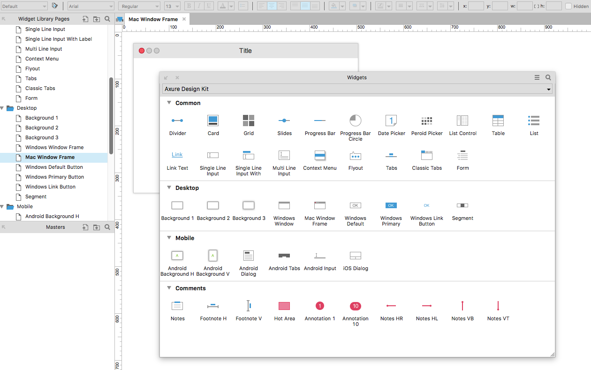
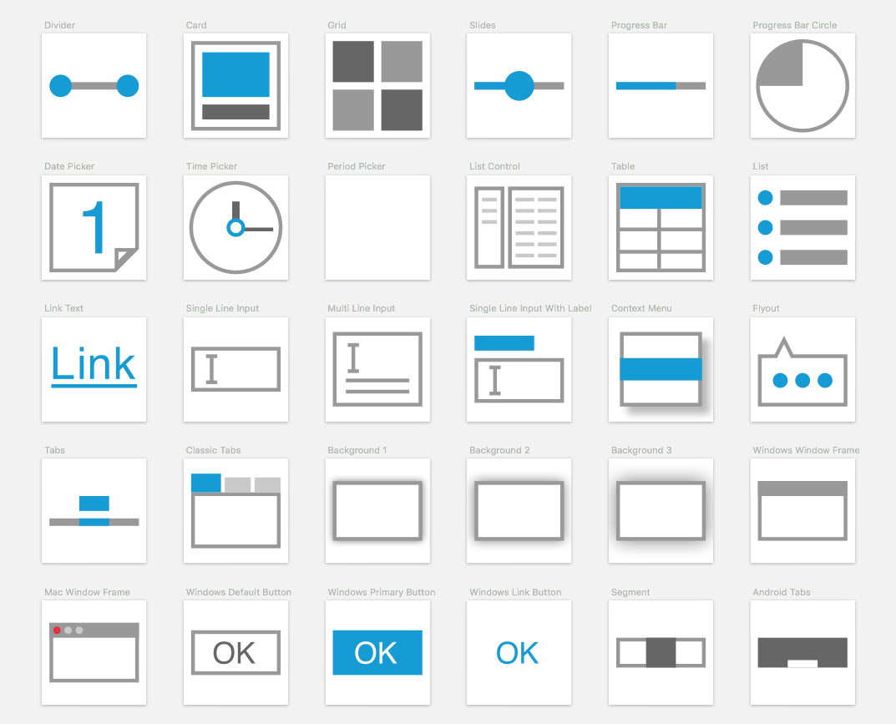

# Design Kit Axure Library

An Axure widget library contained **most** common UI patterns in desktop, web and mobile app design regions.

## Features

-   48 **Most** common UI patterns in desktop, web and mobile app design regions.
-   Contain widget icons in both 28x28 and 56x56 size, and is **consistent** with Axure default style
-   **Only** support Axure 8. You can download Axure 8 [here](http://www.axure.com/download).

Take fun and use it in your current or next prototypes!

## Screenshots

# How to use it?

1. Download the Axure library file: [Disign Kit Axure Library](./Design%20Kit.rplib?raw=true)
2. Open your Axure, click the three bars icon and choose "Load Library". Find the library file to Load it.
3. That's all! You can now enjoy your time for making some really nice prototypes.

# Author

I'm David Peng, a product manager in Shenzhen, China. You can find me on [@davidduzyn](http://twitter.com/davidduzyn) or [my blog](http://www.pengdaiwu.com).
